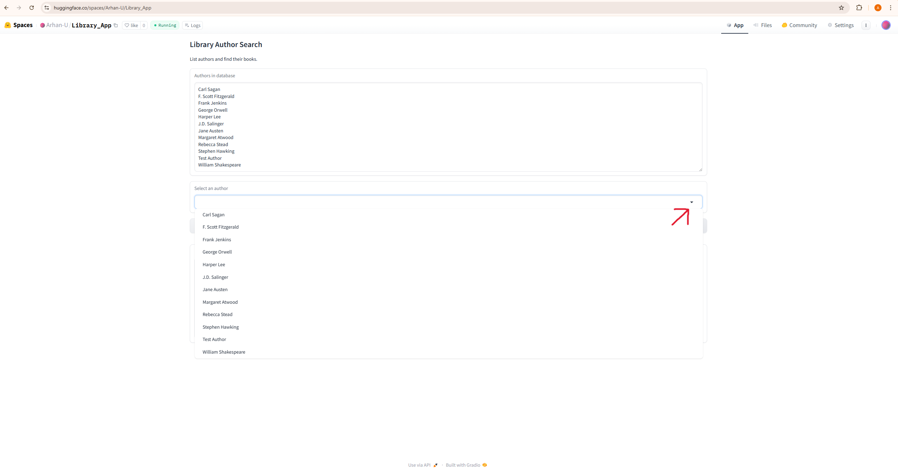
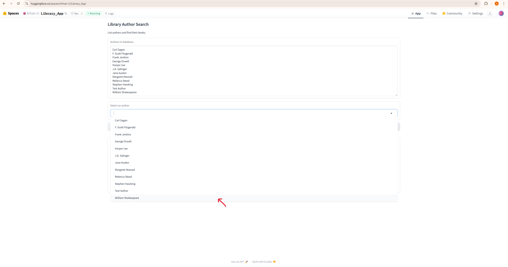
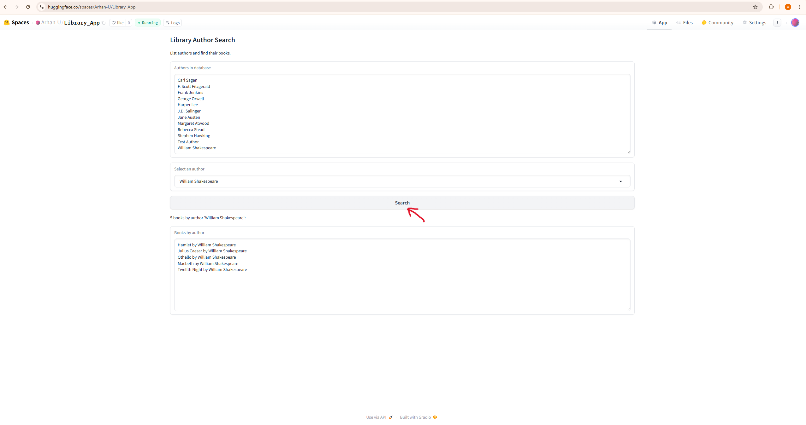
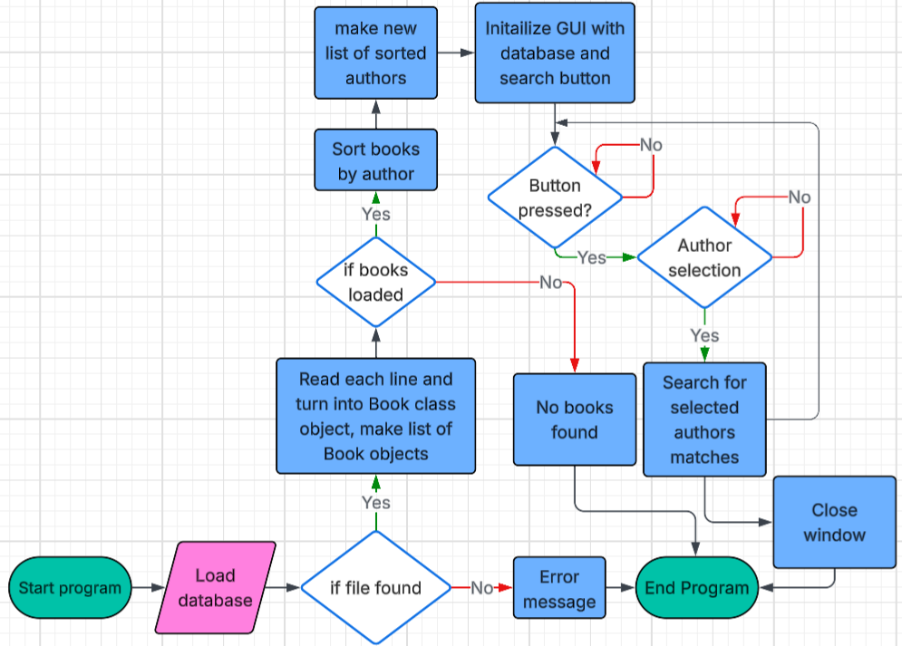

# Library Author Search

## Demo screenshots
- 
- 
- 

## Problem Breakdown & Computational Thinking
- **Decomposition:** parse `books.csv` into `Book` objects; merge-sort by `author.lower()`; build distinct author list; binary-search matches; render UI.
- **Pattern Recognition:** repeated compare/append in merge sort; lower/upper bound binary search to locate the author window.
- **Abstraction:** expose author list and search results; hide parsing, sorting, and index math.
- **Algorithm Design:** merge sort on authors for stable ordering; binary search (lower/upper bounds) for O(log n) author lookup.
- 

## Steps to Run
1. `pip install -r requirements.txt`
2. `python app.py` and open the Gradio link shown in the terminal.
3. CLI mode: `python app.py --cli` to search via the terminal.

## Hugging Face Link
TBD (add your Space URL here, e.g., `https://huggingface.co/spaces/<user>/<space-name>`).

## Author & Acknowledgment
Author: Arhan B. Utku  
Thanks to the Hugging Face Spaces + Gradio community for hosting and tooling.